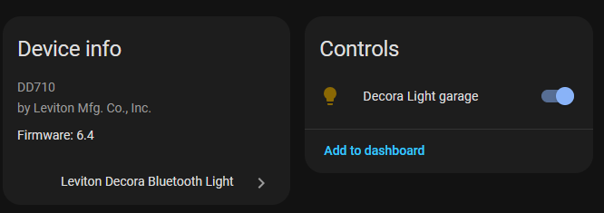

# Leviton Decora Bluetooth (Bleak) — Home Assistant

Control Leviton Decora Bluetooth light switches and dimmers from Home Assistant using the Bleak BLE library. This integration is local-only, fast, and designed to automatically discover and reconnect to your devices.

> Tested with model **DD710**



## Features

- Automatic discovery via Home Assistant Bluetooth
- Local BLE control (no cloud) with secure API key auth
- Brightness and transition support for dimmers
- Automatic reconnection on rediscovery or availability changes
- Manual and auto API key retrieval (pairing mode)

## Requirements

- Home Assistant 2023.7 or newer
- Host with a BLE-capable Bluetooth adapter
- Leviton Decora Bluetooth device (e.g., DD710 and similar)

## Installation

### HACS (Recommended)

1. Open HACS → Integrations
2. Click the menu (⋮) → Custom repositories
3. Add: `https://github.com/dgleo2/ha_decora_bleak` (category: Integration)
4. Search for "Leviton Decora Bluetooth Light" and install
5. Restart Home Assistant

### Manual Installation

1. Copy `custom_components/decora_bleak` into your Home Assistant `config/custom_components` directory
2. Restart Home Assistant

## Configuration

1. Go to Settings → Devices & Services → "Add Integration"
2. Search for "Leviton Decora Bluetooth Light"
3. Select a discovered device, or choose manual entry
4. Provide the API key or use auto-retrieve

### API Key Retrieval

Each device requires an API key (hex string) for authentication.

- Auto-retrieve (recommended): Put the switch in pairing mode by holding the paddle for ~10 seconds until it blinks, then choose "Auto-retrieve API key" during setup.
- Manual entry: Enter the known API key (e.g., `8e89bed6`) and the device MAC address.

## Usage

After setup, you will see standard `light` entities in Home Assistant. Brightness and transition are supported where applicable.

```yaml
# Example automation
automation:
	- alias: "Turn on Decora light at sunset"
		trigger:
			- platform: sun
				event: sunset
		action:
			- service: light.turn_on
				target:
					entity_id: light.decora_light
				data:
					brightness: 150
					transition: 2
```

## Troubleshooting

- Device not found: Ensure the device is powered, in range, and your adapter supports BLE.
- Cannot connect: Confirm the device is not connected to another controller/app.
- Invalid API key: Re-enter or re-retrieve with the device in pairing mode.
- Device unavailable: The integration auto-reconnects when rediscovered; verify power and proximity.

### Enable Debug Logging

```yaml
logger:
	default: info
	logs:
		custom_components.decora_bleak: debug
```

## Development & Releases

- Repository: https://github.com/dgleo2/ha_decora_bleak
- Versioning follows `manifest.json` (e.g., `0.1.0`). Create GitHub releases using matching tags for HACS.

## Credits

All credits to https://github.com/ColinCampbell/decora_bleak for the original implementation and protocol research.

## License

This integration references the upstream project’s work. Please consult the upstream repository for licensing terms and apply the same where appropriate.

## Support

Open issues and requests here: https://github.com/dgleo2/ha_decora_bleak/issues

